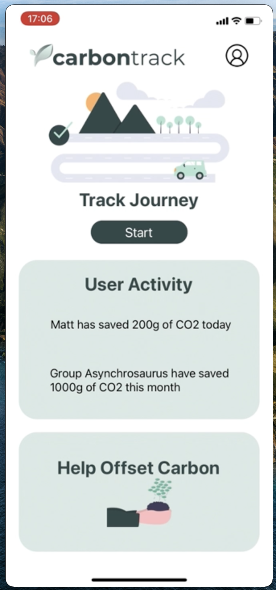

# Carbontrack

Carbontrack calculates the amount of CO2 emitted for a journey. You can then track and compare with friends or family. Work colleagues can create a commuting group or you could simply join a group with other people you know. Or for all those secret green introverts out there the option to ride solo.



The app was built to create awareness for the amount of C02 emissions produced on everyday journeys by car. And provides alternative travel options showing real-time emission savings. Climate change is currently one of the biggest issues facing the planet right now. Hopefully this app can go a small way to increasing awareness around this important topic and getting people involved in the push for better climate action.

You can view the video [here.](https://youtu.be/8BSVHYG0w_M)

## Installation

Use Node Package Manager(minimum version v12) and AWS Amplify(minimum version 4.3.1) to install Carbontrack.

```bash
npm install
amplify pull
```

To run the app on xcode or simulator

```bash
npm start
```
## Tech used

* React Native - for building a mobile app.
* Typescript - for type safety and easier debugging
* AWS Amplify - for linking different AWS services and hosting a database. 
* AWS Cognito - for Authentication. 
* AWS DynamoDB - for noSQL database.
* Axios - for making HTTP reqeusts.
* DVLA API - for tracking carbon offset.
* Google Maps API - for mapping journeys.
* Expo & Xcode - for testing and recording through development phase.

## Contributing
This application was a learning initiative built via software development technique of pair programming between -

* Bora Kim (GitHub - **Kimovi**)
* Conor Mullan (GitHub - **conormullangit**)
* Jatinder Singh (GitHub - **singhjptech**)
* Matt Bush (GitHub - **mattbushdev**)
* Tom Platt (GitHub - **Arcticquiff**)

Most of the tech was new for the contributors and was built in the given timeframe of 2 weeks.

Pull requests are welcome. For major changes, please open an issue first to discuss what you would like to change. 
Please make sure to update tests as appropriate.

## License
[MIT](https://choosealicense.com/licenses/mit/)
